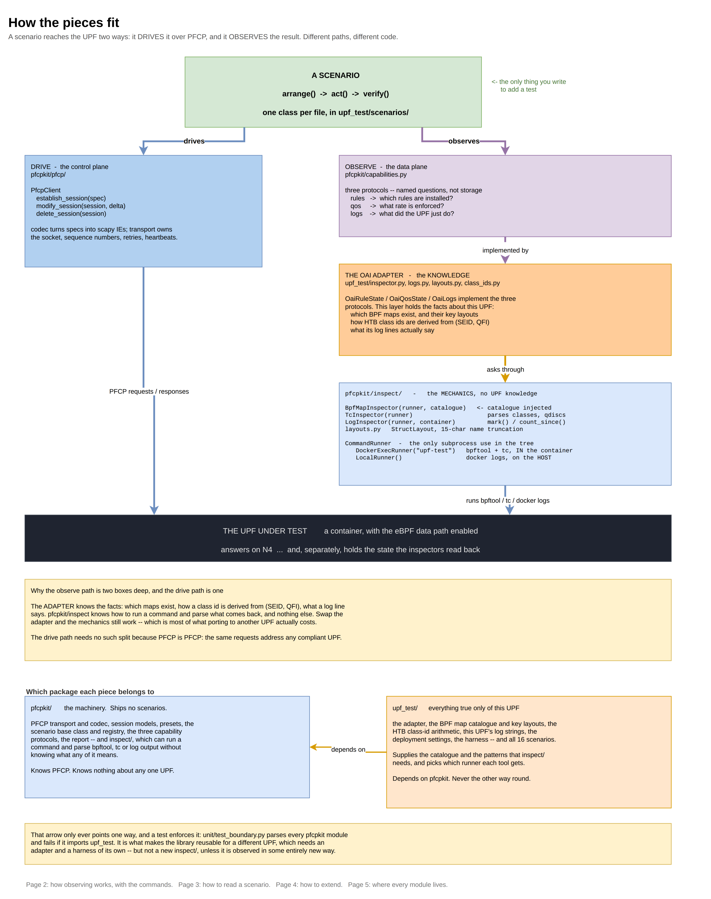
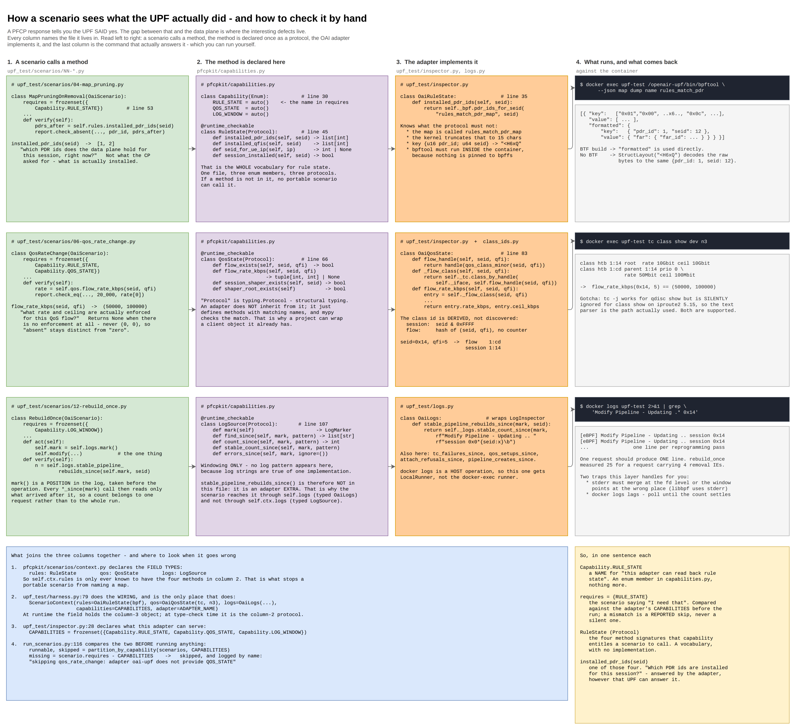
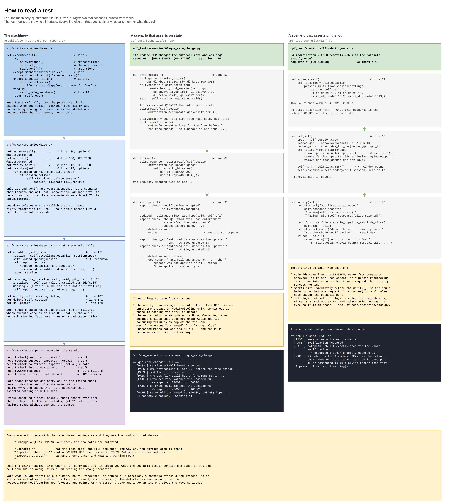
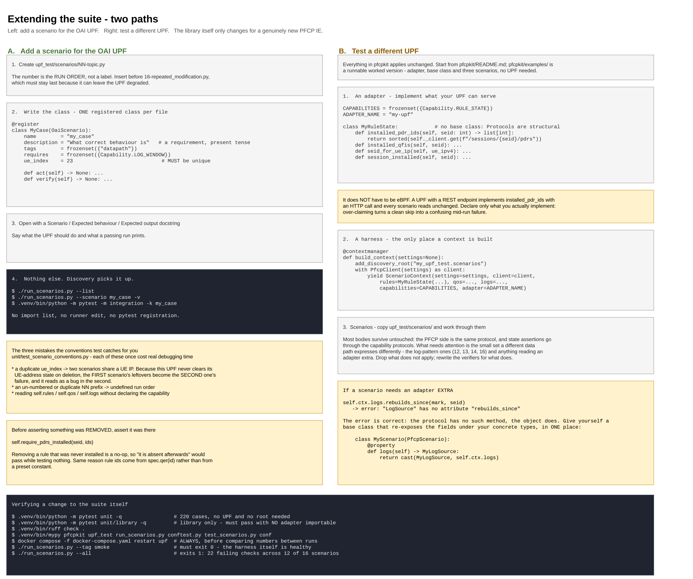
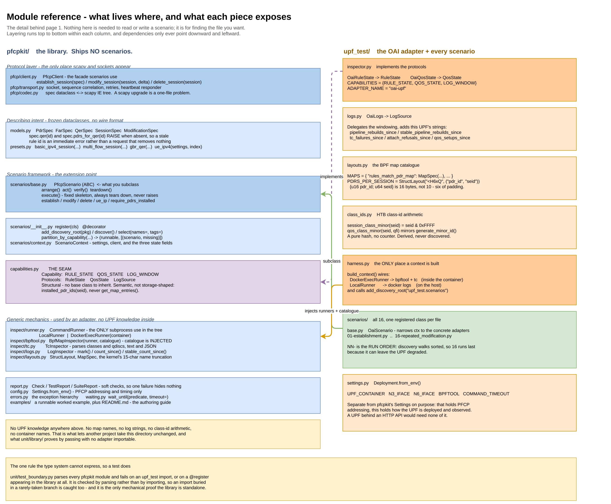

<!-- SPDX-License-Identifier: CC-BY-4.0 -->
# Architecture of the UPF PFCP test suite

A guided read of [`architecture.drawio`](architecture.drawio), one section per page.
Each section says what the diagram shows, what to take from it, and which files to open
next — so this page is worth reading alongside the images rather than instead of them.


| | Page | Answers |
|---|---|---|
| [§1](#1-architecture) | Architecture | how do the pieces fit together? |
| [§2](#2-observing-state) | Observing state | how does a test see what the UPF did — and how do I check it myself? |
| [§3](#3-reading-a-scenario) | Reading a scenario | what am I looking at when I open a test? |
| [§4](#4-extending) | Extending | how do I add a test, or point this at a different UPF? |
| [§5](#5-module-reference) | Module reference | which file is that in? |

---

## 1. Architecture



**What it shows.** A scenario reaches the UPF two ways, and they are different code
paths. It **drives** the UPF over PFCP through `PfcpClient`, and it **observes** the
result through three capability protocols. The observe path is three layers deep, and the
layering is the point:

| Layer | Holds | Lives in |
|---|---|---|
| `capabilities.py` | the *questions* — `installed_pdr_ids`, `flow_rate_kbps`, `mark`/`count_since` | `pfcpkit` |
| the OAI adapter | the *knowledge* — map names, key layouts, HTB class-id arithmetic, log strings | `upf_test` |
| `inspect/` | the *mechanics* — run a command, parse `bpftool`/`tc`/log output | `pfcpkit` |

**Open next:** [`pfcpkit/capabilities.py`](../pfcpkit/capabilities.py) for the three
protocols, then [`upf_test/harness.py`](../upf_test/harness.py) — the one place a context
is built, and therefore the one place the wiring on this page actually happens.

---

## 2. Observing state



**What it shows.** Four columns, each headed with the file it lives in, read left to
right: the call a scenario makes → where that method is declared → how the OAI adapter
answers it → **the shell command that actually answers it**, with real captured output.
Three rows, one per capability.

**What to take from it.** The right-hand column is the useful part in practice. When a
scenario reports something you doubt, that column is how you check it without trusting the
harness:

```bash
# rule state
docker exec upf-test /openair-upf/bin/bpftool --json map dump name rules_match_pdr

# QoS enforcement  (class ids derive from (SEID, QFI) -- seid=0x14, qfi=5 -> 1:cd)
docker exec upf-test tc class show dev n3

# what the UPF did
docker logs upf-test 2>&1 | grep 'Modify Pipeline - Updating .* 0x14'
```

Two gotchas are on the page because both have cost real debugging time: `tc -j` works for
`qdisc show` but is **silently ignored** for `class show` on iproute2 5.15, so the text
parser is the path actually used; and `docker logs` must be read with stderr merged at the
file-descriptor level, or a log window points at the wrong place.

The page also traces how the three columns are joined at runtime —
`context.py` declares the field types, `harness.py` does the wiring,
`inspector.py` declares `CAPABILITIES`, and `run_scenarios.py` compares that against each
scenario's `requires` *before* running anything, so a capability gap is a reported skip
rather than a confusing mid-run failure.

**Open next:** [`upf_test/inspector.py`](../upf_test/inspector.py) and
[`upf_test/logs.py`](../upf_test/logs.py) — between them, everything this suite knows
about how the OAI UPF stores its state.

---

## 3. Reading a scenario



**What it shows.** Three columns. The left one quotes the machinery from
[`pfcpkit/scenarios/base.py`](../pfcpkit/scenarios/base.py) — `execute()`, the four hooks,
the helpers a scenario calls, and the check methods. The other two quote a real scenario
each, `arrange` / `act` / `verify`, with the output it actually produces.

**What to take from it.** Read the `try`/`finally` in `execute()` rather than a
description of it. It settles the three questions people ask about the lifecycle:

- `verify()` is skipped when `act()` raises, because they are in the same `try`;
- `teardown()` runs either way, because it is in the `finally`;
- nothing propagates — every outcome, including an unexpected exception, comes back as a
  `TestReport`, so one scenario blowing up does not end the run.

The fourth question — *why doesn't `act()` run when a precondition fails?* — is answered by
following `report.require()` to `ScenarioAborted` to the `except` clause. That chain is on
the page.

The two scenarios are chosen to contrast: one asserts on **state** through
`ctx.qos`, the other on the **log** through an adapter extra. The second is why
[`upf_test/scenarios/base.py`](../upf_test/scenarios/base.py) exists.

**Open next:** [`upf_test/scenarios/01-establishment.py`](../upf_test/scenarios/01-establishment.py)
— the simplest one in the suite, and it asserts only on PFCP, so it needs no capability at
all.

---

## 4. Extending



**What it shows.** Two paths side by side. Left: add a scenario for the OAI UPF — one
file, one class, and discovery picks it up. Right: point the suite at a different UPF —
write an adapter, a harness, and your own scenarios.

**What to take from it.** For a new scenario, the three mistakes worth knowing are the ones
[`unit/test_scenario_conventions.py`](../unit/test_scenario_conventions.py) catches for
you, because each of them once cost real debugging time: a duplicate `ue_index`, an
unnumbered or duplicate `NN-` prefix, and reading `self.rules` / `self.qos` / `self.logs`
without declaring the capability.

**Open next:** [`pfcpkit/README.md`](../pfcpkit/README.md) is the long-form version of this
page, and [`pfcpkit/examples/`](../pfcpkit/examples/) is a complete worked adapter plus
three scenarios that run with no UPF at all.

---

## 5. Module reference



**What it shows.** Every module in both packages and what it exposes, laid out in the two
columns and layered top to bottom.

**What to take from it.** Nothing, on a first read — this page is for finding a file once
you already know what you are looking for. It is the detail that used to be on page 1 and
made it unreadable.

---

The images in [`img/`](img/) are exported from
[`architecture.drawio`](architecture.drawio). If you change the diagram, re-export them,
or the pages above will drift from what they describe.
